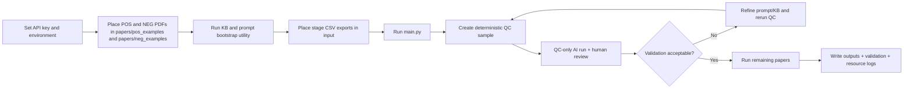

# Automated Review Pipeline (document 1/6)

## Document Purpose

This start document provides the summary view of the review pipeline and links to each detailed guide.

## What to Expect

- A map of all documentation files.
- A high-level workflow and quick start.
- Key runtime notes and output expectations.

## How to Use This Document

1. Read this file first to understand scope and terminology.
2. Follow the linked documents in the listed order.
3. Return here when you need a summary of the full documentation set.

## Acknowledgement and License

- This project is inspired by the FRAG idea: https://github.com/dsl-unibe-ch/rag-framework.
- This repository is licensed under CC BY-NC-SA 4.0 (see [LICENSE](LICENSE)).

## Documentation Overview

- Setup and preparation: [installation_preparation.md](installation_preparation.md)
- Full run order + exact terminal decision tree: [review_procedure.md](review_procedure.md)
- Validation checks and expected files: [pipeline_validation_checks.md](pipeline_validation_checks.md)
- Technical implementation details: [pipeline_architecture_reference.md](pipeline_architecture_reference.md)
- Methodological/governance commitments: [study_protocol_and_governance.md](study_protocol_and_governance.md)
- Function-by-function user explanations (UID format): [function_explanations_uid.md](function_explanations_uid.md)

## Workflow Summary Diagram

## Quick Start

1. Connect to the University of Bern network (eduroam/campus LAN/VPN).
2. Activate venv:
   - Windows: `.venv\Scripts\activate`
   - macOS/Linux: `source .venv/bin/activate`
3. Install dependencies: `python -m pip install -r requirement.txt`
4. Place positive and negative example PDFs:
  - positive examples: `papers/pos_examples/`
  - negative examples: `papers/neg_examples/`
5. Build stage KB files and suggested prompts from those PDFs:
  - `python -m pipeline.additions.bootstrap_stage_kb_and_prompts`
6. (Optional, `full_text`) Generate a cleaned-hybrid KB draft without modifying existing KB source files:
  - `python -m pipeline.additions.generate_cleaned_hybrid_kb_draft`
7. Set `.env` with `LLM_API_KEY=...`
8. Set `CURRENT_STAGE`, `LLM_MODEL`, and `EMBED_MODEL` in [config/user_orchestrator.py](config/user_orchestrator.py)
9. (Optional) Select KB files for this run in [config/user_orchestrator.py](config/user_orchestrator.py):
  - set per-stage defaults in `KNOWLEDGE_BASE_FILES`
  - set one-off stage swaps in `KB_FILE_OVERRIDES`
10. Run:
   - Windows: `.venv\Scripts\python main.py`
   - macOS/Linux: `python main.py`

## Initial Inputs for Optimal Pipeline Performance

Provide these items before the first screening run:

1. Positive example PDFs in [papers/pos_examples](papers/pos_examples) that clearly represent in-scope records.
2. Negative example PDFs in [papers/neg_examples](papers/neg_examples) that clearly represent out-of-scope records.
3. A balanced example set whenever possible (recommended minimum: 5 POS and 5 NEG, better: >=10 each).
4. PDF files with selectable text (not image-only scans), because chunk selection quality depends on text extraction quality.
5. Stage input CSV exports in [input](input) (`*_screen_csv_*`, `*_select_csv_*`, `*_included_csv_*`).

Practical recommendation:
- Keep file names descriptive (author/year/title style) to improve traceability in generated `source` fields.
- Prefer representative examples over edge cases for the first bootstrap run.

## KB and Prompt Bootstrap Utility

Use this command to generate all stage knowledge bases and first-pass prompt suggestions from your local example PDFs:

- `python -m pipeline.additions.bootstrap_stage_kb_and_prompts`

Primary outputs:

1. [knowledge-base/title_abstract_pos-neg_examples.csv](knowledge-base/title_abstract_pos-neg_examples.csv)
2. [knowledge-base/full_text_pos-neg_examples.csv](knowledge-base/full_text_pos-neg_examples.csv)
3. [knowledge-base/data_extraction_pos-neg_examples.csv](knowledge-base/data_extraction_pos-neg_examples.csv)
4. [config/prompt_script_title_abstract_suggested.txt](config/prompt_script_title_abstract_suggested.txt)
5. [config/prompt_script_full_text_suggested.txt](config/prompt_script_full_text_suggested.txt)
6. [config/prompt_script_data_extraction_suggested.txt](config/prompt_script_data_extraction_suggested.txt)
7. [knowledge-base/kb_bootstrap_summary.json](knowledge-base/kb_bootstrap_summary.json)

If you want the pipeline to use the suggested prompts immediately, copy the selected suggested file content into the active prompt files in [config](config).
The bootstrap utility derives suggested prompt terms and chunk-ranking cues from your local POS/NEG example PDFs instead of fixed review-topic term lists.

## Optional Full-Text Cleaned-Hybrid KB Draft Utility

Use this command when you want a conservative full-text KB draft that blends the short reasoning KB with cleaned chunk evidence while keeping your current KB files untouched:

- `python -m pipeline.additions.generate_cleaned_hybrid_kb_draft`

Draft outputs:

1. [knowledge-base/full_text_pos-neg_examples_cleaned_hybrid_draft.csv](knowledge-base/full_text_pos-neg_examples_cleaned_hybrid_draft.csv)
2. [knowledge-base/full_text_pos-neg_examples_cleaned_hybrid_draft_report.json](knowledge-base/full_text_pos-neg_examples_cleaned_hybrid_draft_report.json)

Behavior notes:
- Non-destructive: source KB files are not overwritten.
- Balanced additions: draft generation keeps POS/NEG class balance.
- Opt-in only: pipeline uses this draft only if selected through `KB_FILE_OVERRIDES["full_text"]` (or by changing `KNOWLEDGE_BASE_FILES["full_text"]`).

## Dependency Behavior

- `pdfplumber` is required for PDF-reading stages (`full_text`, `data_extraction`).
- `PyPDF2` is used as a fallback extractor when page text from `pdfplumber` is too sparse.
- `langdetect` is used for language-code detection that supports the EN/DE full-text policy check.
- `codecarbon` is optional at runtime: if unavailable, screening still runs and emissions tracking is skipped with a warning.
- Recommended reinstall command when dependencies drift:
  - `python -m pip install --upgrade pip setuptools wheel`
  - `python -m pip install -r requirement.txt`

## Required Files by Stage

- `title_abstract`
  - input CSV: `*_screen_csv_*.csv`
  - Knowledge-base default: [knowledge-base/title_abstract_pos-neg_examples.csv](knowledge-base/title_abstract_pos-neg_examples.csv)
  - Knowledge-base override: set `KNOWLEDGE_BASE_FILES["title_abstract"]` or `KB_FILE_OVERRIDES["title_abstract"]` in [config/user_orchestrator.py](config/user_orchestrator.py)
  - LLM input behavior: full `Title + Abstract` is passed directly to `{data}` (no chunking/top-k filtering in this stage)
- `full_text`
  - input CSV: `*_select_csv_*.csv`
  - Knowledge-base default: [knowledge-base/full_text_pos-neg_examples.csv](knowledge-base/full_text_pos-neg_examples.csv)
  - Knowledge-base override: set `KNOWLEDGE_BASE_FILES["full_text"]` or `KB_FILE_OVERRIDES["full_text"]` in [config/user_orchestrator.py](config/user_orchestrator.py)
  - Optional cleaned-hybrid draft: [knowledge-base/full_text_pos-neg_examples_cleaned_hybrid_draft.csv](knowledge-base/full_text_pos-neg_examples_cleaned_hybrid_draft.csv)
  - Optional draft report: [knowledge-base/full_text_pos-neg_examples_cleaned_hybrid_draft_report.json](knowledge-base/full_text_pos-neg_examples_cleaned_hybrid_draft_report.json)
  - PDFs: one PDF per folder in `input/per_paper_full_text/`
  - first run behavior: `main.py` creates `per_paper_full_text/` folders and stops; upload all PDFs, then rerun to start screening
  - per-paper machine artifacts use `SCREENING_DEFAULTS["artifact_mode"]` (default `compact`)
  - compact mode writes `full_text_artifact.json` plus a human-readable `full_text_normalized.txt`
  - full mode keeps legacy normalized cache sidecars (`*_normalized_text.txt`, `*_normalized_pages.json`, `*_normalized_meta.json`)
- `data_extraction`
  - input CSV: `*_included_csv_*.csv`
  - Knowledge-base default: [knowledge-base/data_extraction_pos-neg_examples.csv](knowledge-base/data_extraction_pos-neg_examples.csv)
  - Knowledge-base override: set `KNOWLEDGE_BASE_FILES["data_extraction"]` or `KB_FILE_OVERRIDES["data_extraction"]` in [config/user_orchestrator.py](config/user_orchestrator.py)
  - PDFs reused in `input/per_paper_data_extraction/`
  - extraction schema and Covidence validation mapping are read from `DATA_EXTRACTION_SCHEMA_FILE` in [config/user_orchestrator.py](config/user_orchestrator.py)
  - CSV/admin headers are read through `CSV_METADATA_COLUMN_ALIASES` and `DATA_EXTRACTION_ADMIN_OUTPUT_COLUMNS` in [config/user_orchestrator.py](config/user_orchestrator.py); pipeline Python stays topic- and export-vendor-generic
  - prompt-to-domain matching uses schema text plus optional `DATA_EXTRACTION_DOMAIN_PROMPT_ALIASES` in [config/user_orchestrator.py](config/user_orchestrator.py)
  - extraction defaults to schema-domain batches, so each LLM response stays small enough to validate while configured groups reduce repeated full-text calls
  - [config/prompt_script_data_extraction.txt](config/prompt_script_data_extraction.txt) is the human-readable conceptual framework. It should not contain technical insertion markers; the pipeline automatically inserts the active schema CSV contract before `# CONTEXT` at runtime.
  - with `data_extraction_split_by_domain=True`, `data_extraction_domain_groups` can group compatible schema domains into fewer calls; use input traces to inspect the exact schema-injected runtime prompt
  - direct async command remains available: `python -m pipeline.core.run_extraction`
  - `data_extraction_pos-neg_examples.csv` mainly matters when `LLM_SETTINGS["data_extraction_evidence_mode"]="selected_chunks"`; with the default `full_text` mode, the LLM receives cached normalized full text, so extraction quality is driven mostly by `data_extraction_schema.csv` and `prompt_script_data_extraction.txt`

Eligibility criteria can be centrally stored in [knowledge-base/eligibility_criteria.txt](knowledge-base/eligibility_criteria.txt).
- The file is injected only when a stage prompt contains `{eligibility_criteria}`.
- If the placeholder is absent, the file is ignored.
- If the placeholder is present but the file is missing, the pipeline continues (warning + empty replacement).

Knowledge-base format for all stages: CSV with columns `label` (`POS`/`NEG`) and `text` (short evidence); recommended >=10 `POS` and >=10 `NEG`.

## Topic Adaptation Guide

Use this block when you switch to a different review topic.

1. Update prompt schema and criteria.
  - Edit the active stage prompt file in [config](config) (`prompt_script_title_abstract.txt` or `prompt_script_full_text.txt`).
  - In `# END GOAL`, define the exclusion flag keys for your topic as JSON keys.
  - Keep core keys present: `is_eligible`, `confidence_score`, `justification`, `exclusion_reason_category`.
2. Update study tags in [config/user_orchestrator.py](config/user_orchestrator.py).
  - Edit the `USER-EDITABLE STUDY TAGS` block so each `STUDY_TAGS_INCLUDE` entry represents one exclusion category you expect in QC validation.
  - Tags are normalized to snake_case internally, so `No intervention` maps to `no_intervention`.
3. Update CSV/export aliases in [config/user_orchestrator.py](config/user_orchestrator.py).
  - Edit `CSV_METADATA_COLUMN_ALIASES` when your input export uses different paper ID, title, author, year, reviewer, or study ID headers.
  - Edit `DATA_EXTRACTION_ADMIN_OUTPUT_COLUMNS` if the aggregate extraction CSVs need different administrative column labels.
  - Edit `PROMPT_SIGNAL_SECTION_ALIASES` and `DATA_EXTRACTION_DOMAIN_PROMPT_ALIASES` only when your prompt section names need explicit help mapping to retrieval signals or extraction domains.
4. Update the stage knowledge base.
  - Replace POS/NEG examples with topic-matched examples in [knowledge-base](knowledge-base).
  - For data extraction, set `DATA_EXTRACTION_SCHEMA_FILE` if the schema CSV is renamed or moved.
5. Run QC first, then confirm alignment.
  - Start with QC sampling and verify AI vs human output before full screening.
6. Verify startup and diagnostics.
  - Startup now prints dynamic schema summary lines (`[schema] ...`) with active exclusion keys and source counts.
  - In diagnostics, check `selection_trace.schema_exclusion_tag_count` and `selection_trace.schema_exclusion_tags_preview`.

Dynamic behavior implemented in pipeline:
- Exclusion schema is built from `STUDY_TAGS_INCLUDE` plus prompt `END GOAL` exclusion fields.
- Topic retrieval signals are derived from prompt include lists and KB examples, without hidden protocol-specific seed terms in Python code.
- Prompt-derived retrieval/schema signal helpers live in `pipeline/selection/prompt_signals.py`, keeping the main pipeline class focused on orchestration.
- `main.py` keeps the interactive stage flow; retry bookkeeping, output indexing, and startup checks live in focused `pipeline/additions` modules.
- Data-extraction validation is dynamic: each KB `variable_name` maps to the exact Covidence header in `covidence_column_name`.
- Data-extraction prompting is prompt-driven plus CSV-validated: users edit the prompt for review concepts/domains and edit `DATA_EXTRACTION_SCHEMA_FILE` for exact output variables, value types, missing-value rules, and Covidence headers.
- Input metadata and aggregate-output administrative labels are config-driven through `CSV_METADATA_COLUMN_ALIASES` and `DATA_EXTRACTION_ADMIN_OUTPUT_COLUMNS`, so a different export system should require config edits rather than pipeline edits.
- No code edits are required for topic changes if prompt, knowledge base, and `user_orchestrator.py` are updated consistently.

## Quality Control and Retry Behavior

- QC is enabled by default (`QC_ENABLED=True`): pipeline generates a deterministic ~10% sample (`ceil(sample_rate * N)`).
- `title_abstract` now uses asynchronous LLM batching with bounded concurrency and exponential backoff for transient API/rate-limit failures.
- Screening responses are validated against a strict JSON schema (Pydantic); invalid JSON/missing fields trigger automatic retry up to 3 attempts.
- Near-valid screening payload drift is normalized before validation (for example, `step_by_step_deliberation` returned as an object is flattened to a string), then validated strictly.
- Full-text sentence chunking now uses a conservative text-normalization pass (spacing and punctuation cleanup) before sentence splitting to improve readability and LLM input consistency.
- Full-text extraction now uses hybrid PDF parsing (pdfplumber + PyPDF fallback) and removes repeated page headers/footers.
- Full-text artifact persistence now supports two modes:
  - `compact` (default): writes `full_text_artifact.json` and `full_text_normalized.txt` per paper and removes legacy normalized sidecars.
  - `full`: keeps legacy normalized sidecars (`*_normalized_text.txt`, `*_normalized_pages.json`, `*_normalized_meta.json`).
- In compact mode, the metadata block in `full_text_normalized.txt` is synchronized from `full_text_artifact.json` -> `metadata`.
- Full-text chunking now filters low-information sentence fragments (table-like/citation-like noise) before chunk assembly.
- Full-text retrieval now uses a hybrid score (embedding + method/triad signals + readability + sentence completeness) to prioritize informative chunks.
- Full-text retrieval now enforces a final raw-chunk safety net so decisions do not collapse to title-only context when selected non-title evidence is empty.
- Full-text language policy excludes non-EN/DE PDFs before LLM screening; all other in/exclusion decisions remain LLM-driven.
- Full-text adjudication keeps a valid final JSON decision even if still borderline after the last adjudication pass, and records the guardrail state in diagnostics instead of forcing a hard validation error.
- Full-text high-confidence seed logic is strict: `seed_references=true` is only valid when `is_eligible=true` and `confidence_score>0.98`; for such high-confidence includes, `seed_references` must be explicitly true or false.
- Prompt template snapshots are written only for real screening runs (not split-only folder preflight) and are deduplicated by prompt campaign content.
- QC outputs are written to `output/<stage>/` as:
  - `<stage>_qc_sample_batch_<timestamp>.csv`
  - `<stage>_qc_sample_batch_readable_<timestamp>.txt`
- Full run starts only after QC confirmation.
- Retries stay isolated and are never merged into base eligibility/chunks/readable/resource files.
- Deterministic token-limit/context-overflow failures are not auto-retried; adjust payload or token limit first.
- Retry metadata is appended to `output/<stage>/<stage>_retry_manifest.jsonl`.
- Eligibility diagnostics now include per-paper hashes (`llm_input_sha256`, `full_prompt_sha256`) for exact input verification.

## Validation Commands

- title/abstract:
  - `python -m pipeline.additions.stats_engine --select <select_csv> --irrelevant <irrelevant_csv>`
- full text:
  - `python -m pipeline.additions.stats_engine --included <included_csv> --excluded <excluded_csv>`
- data extraction:
  - `python -m pipeline.additions.stats_engine --consensus <Covidence_gold_standard.csv>`

## Input-Forensics Utility

- `python -m pipeline.additions.input_trace --paper-id <ID> --stage <stage>` reconstructs the model input text for one paper and verifies it against stored hashes.
- The utility is on-demand by design (no full-input snapshots are written for every paper during standard runs).

## Key Outputs

In `output/<stage>/` (or per-paper subfolders for extraction):

- Eligibility JSONL (screening stages):
  - `<stage>_<sample>_sample_<main|retry_#>_eligibility_<timestamp>_<promptid>.jsonl`
  - split files (`select/irrelevant` or `included/excluded`) with the same prefix pattern
- Selected chunks JSONL
- Human-readable TXT summary
- QC validation report/matrix/alignment CSV
- Resource log: `<stage>_<sample>_sample_<main|retry_#>_resource_usage_<timestamp>.log`
- CodeCarbon emissions CSV (merged per sample with `run` column)

Full-text per-paper input artifacts (`input/per_paper_full_text/<paper_folder>/`):
- always: `full_text_artifact.json` and one PDF
- compact mode (default): `full_text_artifact.json`, `full_text_normalized.txt`
- optional in compact mode: `full_text_selected_chunks.jsonl` only when `compact_keep_legacy_selected_chunks=True`
- full mode: legacy normalized sidecars (`*_normalized_text.txt`, `*_normalized_pages.json`, `*_normalized_meta.json`)

Data extraction additionally writes per-paper:
- `data_extraction_results.jsonl` and `data_extraction_results.csv`
- `data_extraction_evidence.json`

Data extraction run-level exports for review and audit:
- The files are created at the start of a data-extraction run and appended as each QC or remaining paper finishes.
- `python -m pipeline.additions.export_extraction_tables` can still rebuild them from per-paper JSONL files.
- `data_extraction_all_papers_for_consensus_comparison.csv`: one AI row per paper in the same header layout as `input/data_extraction_schema.csv`
- `data_extraction_all_papers_quote_audit.csv`: long audit table with value plus supporting quote for every variable

Data-extraction validation additionally writes run-level exports:
- `data_extraction_extraction_accuracy_report.txt`
- `data_extraction_extraction_accuracy_report.csv`
- `extraction_error_audit.csv`

Data-extraction schema and validation mapping:
- The configured extraction schema CSV defines `domain`, `variable_name`, `variable_type`, `allowed_options`, `instruction`, and `covidence_column_name`.
- The LLM output uses `{variable_name}_value` and `{variable_name}_quote` under each domain.
- Validation maps each LLM value field to the exact Covidence header named in `covidence_column_name`.
- `LLM_SETTINGS["data_extraction_split_by_domain"]` defaults to `True`; this validates smaller schema-domain batches instead of one fragile all-fields JSON response. `data_extraction_domain_groups` can combine compatible domains into fewer calls, and `data_extraction_domain_max_tokens` caps each batch response.
- `LLM_SETTINGS["data_extraction_response_format_mode"]` defaults to `prompt_only` for GPUSstack compatibility; use `json_schema` only with a backend proven to enforce OpenAI Structured Outputs.
- `LLM_SETTINGS["data_extraction_evidence_mode"]` defaults to `full_text`, so extraction uses cached `full_text_normalized.txt` instead of only the selected screening chunks.

Data-extraction evidence modes:
- `full_text` mode, current default:
  - Pros: highest recall; does not depend on retrieval quality; best for final extraction and quote audit. Grouped domain-wise extraction keeps responses valid while reducing the number of repeated full-text calls.
  - Cons: higher token use than selected chunks; the full text is repeated for each configured domain batch.
  - POS/NEG KB impact: low. `data_extraction_schema.csv` and the extraction prompt drive quality.
- `selected_chunks` mode:
  - Pros: much lower token use; faster; `data_extraction_pos-neg_examples.csv` can improve chunk retrieval.
  - Cons: lower recall if important evidence is not selected; riskier for final extraction unless chunk selection is well validated.
  - POS/NEG KB impact: high. Curate concise POS/NEG snippets when using this mode.

## High-Priority Failure Checks

- Missing `LLM_API_KEY` in [.env](.env)
- Missing/empty stage KB file in [knowledge-base](knowledge-base)
- Missing/invalid criteria section inside prompt script for `title_abstract` or `full_text`
- Missing PDFs for `full_text` or `data_extraction`
- `CURRENT_STAGE` set to wrong stage in [config/user_orchestrator.py](config/user_orchestrator.py)

## Manual Backup

- Auto-prompt appears after `main.py` run.
- Manual command: `python backup_to_github.py`
- Backup uses `git add -A`; `.gitignore` keeps local artifact trees (`input/`, `output/`, `papers/`, `_tests/`, etc.) out of commits by default.

## Notes

- Change only [config/user_orchestrator.py](config/user_orchestrator.py) for daily runs.
- Knowledge-base file selection is configurable per stage/run using `KNOWLEDGE_BASE_FILES` and `KB_FILE_OVERRIDES` in [config/user_orchestrator.py](config/user_orchestrator.py).
- Total context budget is model-configurable in `LLM_SETTINGS["context_window_total_tokens"]` (input + output).
- Keep `LLM_SETTINGS["max_tokens"]` lower than `context_window_total_tokens`; effective prompt budget is computed as `context_window_total_tokens - max_tokens`.
- Endpoint-safe optimization profile defaults are now set to: `SCREENING_DEFAULTS.top_k=10`, `EMBEDDING_SETTINGS.chunk_size=20`, `LLM_SETTINGS.async_max_concurrency=2`.
- Async LLM controls are in `LLM_SETTINGS`: `async_max_concurrency`, `async_max_retries`, `async_backoff_base_seconds`, `async_backoff_max_seconds`, `async_jitter_seconds`.
- Data-extraction output controls are in `LLM_SETTINGS`: `data_extraction_split_by_domain`, `data_extraction_domain_groups`, `data_extraction_response_format_mode`, `data_extraction_domain_max_tokens`, `data_extraction_evidence_mode`, and `data_extraction_full_text_max_words`.
- Stage toggles for async processing: `async_enable_full_text`, `async_enable_data_extraction`.
- Async heartbeat log interval: `async_heartbeat_seconds` (default `30`).
- Per-paper artifact controls are in `SCREENING_DEFAULTS`:
  - `artifact_mode`: `compact` (default) or `full`
  - `compact_keep_legacy_selected_chunks`: keep/remove `*_selected_chunks.jsonl` sidecars in compact mode
  - `fulltext_preparse_before_screening`: default `True`; set `False` for fastest large full-text runs
  - `fulltext_preparse_log_each_paper`: default `True`; set `False` for quieter preparse
- Optional UBELIX rough estimate in `config/user_orchestrator.py` via `UBELIX_ESTIMATION_CONFIG` (uses runtime + TDP + PUE; excludes embodied emissions).
- UBELIX assumption log fields can be filled in `UBELIX_ESTIMATION_CONFIG["assumptions"]` (source + date for PUE, grid intensity, and resource usage) and are written to the `TOTAL` resource log line.
- Green-Algorithms style factors supported in `UBELIX_ESTIMATION_CONFIG`: `core_usage_factor`, `memory_gb`, `memory_power_watts_per_gb`, `multiplicative_factor`.
- Keep one stage at a time: `title_abstract` -> `full_text` -> `data_extraction`.
- Use newest CSV exports per stage in [input](input).

---
**Read next:** [installation_preparation.md](installation_preparation.md)
