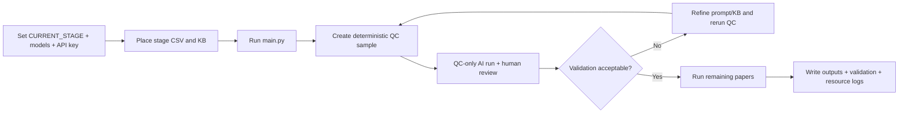

# Automated Review Pipeline (document 1/6)

Stage-based pipeline for title/abstract screening, full-text screening, and data extraction with transparent logs and optional quality control sampling for human validation.

## Acknowledgement and license

- This project is inspired by the FRAG idea: https://github.com/dsl-unibe-ch/rag-framework.
- This repository is licensed under CC BY-NC-SA 4.0 (see [LICENSE](LICENSE)).

## Documentation overview

- Setup and preparation: [installation_preparation.md](installation_preparation.md)
- Full run order + exact terminal decision tree: [review_procedure.md](review_procedure.md)
- Validation checks and expected files: [pipeline_validation_checks.md](pipeline_validation_checks.md)
- Technical implementation details: [pipeline_architecture_reference.md](pipeline_architecture_reference.md)
- Methodological/governance commitments: [study_protocol_and_governance.md](study_protocol_and_governance.md)
- Function-by-function user explanations (UID format): [function_explanations_uid.md](function_explanations_uid.md)

## Workflow summary diagram

## Quick start

1. Connect to the University of Bern network (eduroam/campus LAN/VPN).
2. Activate venv:
   - Windows: `.venv\Scripts\activate`
   - macOS/Linux: `source .venv/bin/activate`
3. Install dependencies: `python -m pip install -r requirement.txt`
4. Set `.env` with `LLM_API_KEY=...`
5. Set `CURRENT_STAGE`, `LLM_MODEL`, and `EMBED_MODEL` in [config/user_orchestrator.py](config/user_orchestrator.py)
6. Run:
   - Windows: `.venv\Scripts\python main.py`
   - macOS/Linux: `python main.py`

## Required files by stage

- `title_abstract`
  - input CSV: `*_screen_csv_*.csv`
  - Knowledge-base: [knowledge-base/title_abstract_pos-neg_examples.csv](knowledge-base/title_abstract_pos-neg_examples.csv)
  - LLM input behavior: full `Title + Abstract` is passed directly to `{data}` (no chunking/top-k filtering in this stage)
- `full_text`
  - input CSV: `*_select_csv_*.csv`
  - Knowledge-base: [knowledge-base/full_text_pos-neg_examples.csv](knowledge-base/full_text_pos-neg_examples.csv)
  - PDFs: one PDF per folder in `input/per_paper_full_text/`
- `data_extraction`
  - input CSV: `*_included_csv_*.csv`
  - Knowledge-base: [knowledge-base/data_extraction_pos-neg_examples.csv](knowledge-base/data_extraction_pos-neg_examples.csv)
  - PDFs reused in `input/per_paper_data_extraction/`

Eligibility criteria can be centrally stored in [knowledge-base/eligibility_criteria.txt](knowledge-base/eligibility_criteria.txt).
- The file is injected only when a stage prompt contains `{eligibility_criteria}`.
- If the placeholder is absent, the file is ignored.
- If the placeholder is present but the file is missing, the pipeline continues (warning + empty replacement).

Knowledge-base format for all stages: CSV with columns `label` (`POS`/`NEG`) and `text` (short evidence); recommended >=10 `POS` and >=10 `NEG`.

## Quality control (QC) and retry behavior

- QC is enabled by default (`QC_ENABLED=True`): pipeline generates a deterministic ~10% sample (`ceil(sample_rate * N)`).
- `title_abstract` now uses asynchronous LLM batching with bounded concurrency and exponential backoff for transient API/rate-limit failures.
- Screening responses are validated against a strict JSON schema (Pydantic); invalid JSON/missing fields trigger automatic retry up to 3 attempts.
- QC outputs are written to `output/<stage>/` as:
  - `<stage>_qc_sample_batch_<yyyymmdd>_<hh-mm>.csv`
  - `<stage>_qc_sample_batch_readable_<yyyymmdd>_<hh-mm>.txt`
- Full run starts only after QC confirmation.
- Retries stay isolated and are never merged into base eligibility/chunks/readable/resource files.
- Deterministic token-limit/context-overflow failures are not auto-retried; adjust payload or token limit first.
- Retry metadata is appended to `output/<stage>/<stage>_retry_manifest.jsonl`.
- Eligibility diagnostics now include per-paper hashes (`llm_input_sha256`, `full_prompt_sha256`) for exact input verification.

## Validation commands

- title/abstract:
  - `python -m pipeline.additions.stats_engine --select <select_csv> --irrelevant <irrelevant_csv>`
- full text:
  - `python -m pipeline.additions.stats_engine --included <included_csv> --excluded <excluded_csv>`
- data extraction:
  - `python -m pipeline.additions.stats_engine --consensus <data_extraction_consensus.csv>`

## Input-forensics utility

- `python -m pipeline.additions.input_trace --paper-id <ID> --stage <stage>` reconstructs the model input text for one paper and verifies it against stored hashes.
- The utility is on-demand by design (no full-input snapshots are written for every paper during standard runs).

## Key outputs

In `output/<stage>/` (or per-paper subfolders for extraction):

- Eligibility JSONL (screening stages):
  - `<stage>_eligibility_<qc_sample|remaining_sample>_*.jsonl`
  - split files (`select/irrelevant` or `included/excluded`)
- Selected chunks JSONL
- Human-readable TXT summary
- QC validation report/matrix/alignment CSV
- Resource log: `<stage>_<sample>_sample_<main|retry_#>_resource_usage_<yyyymmdd>_<hh-mm>.log`
- CodeCarbon emissions CSV (merged per sample with `run` column)

Data extraction additionally writes per-paper:
- `data_extraction_extraction_results.jsonl`
- `data_extraction_extraction_results.csv`
- `data_extraction_evidence.json`

## High-priority failure checks

- Missing `LLM_API_KEY` in [.env](.env)
- Missing/empty stage KB file in [knowledge-base](knowledge-base)
- Missing/invalid criteria section inside prompt script for `title_abstract` or `full_text`
- Missing PDFs for `full_text` or `data_extraction`
- `CURRENT_STAGE` set to wrong stage in [config/user_orchestrator.py](config/user_orchestrator.py)

## Manual backup

- Auto-prompt appears after `main.py` run.
- Manual command: `python backup_to_github.py`

## Notes

- Change only [config/user_orchestrator.py](config/user_orchestrator.py) for daily runs.
- Async LLM controls are in `LLM_SETTINGS`: `async_max_concurrency`, `async_max_retries`, `async_backoff_base_seconds`, `async_backoff_max_seconds`, `async_jitter_seconds`.
- Stage toggles for async processing: `async_enable_full_text`, `async_enable_data_extraction`.
- Async heartbeat log interval: `async_heartbeat_seconds` (default `30`).
- Optional UBELIX rough estimate in `config/user_orchestrator.py` via `UBELIX_ESTIMATION_CONFIG` (uses runtime + TDP + PUE; excludes embodied emissions).
- UBELIX assumption log fields can be filled in `UBELIX_ESTIMATION_CONFIG["assumptions"]` (source + date for PUE, grid intensity, and resource usage) and are written to the `TOTAL` resource log line.
- Green-Algorithms style factors supported in `UBELIX_ESTIMATION_CONFIG`: `core_usage_factor`, `memory_gb`, `memory_power_watts_per_gb`, `multiplicative_factor`.
- Keep one stage at a time: `title_abstract` -> `full_text` -> `data_extraction`.
- Use newest CSV exports per stage in [input](input).

---
**Read next:** [installation_preparation.md](installation_preparation.md)